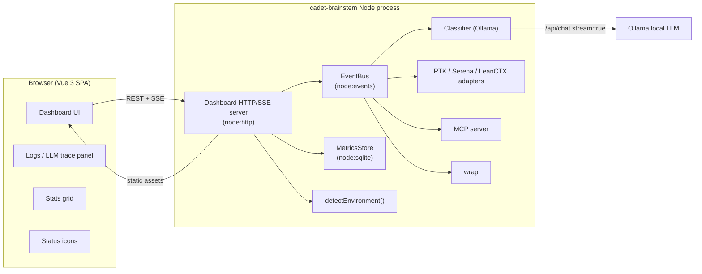

# Dashboard — Technical Design

**Status:** Draft
**Author:** cadet-brainstem engineering
**Date:** 2026-08-30
**Related:** `docs/plans/initial_design.md` §9 (Dashboard) & §11 (Telemetry); `tasks/18-dashboard-command.md`; `tasks/19-dashboard-web-ui.md`

---

## 1. Overview

Build a **locally hosted, browser-based dashboard** for cadet-brainstem, modelled on the
"fire up a local dashboard and open it in a small browser" pattern used by Serena.

It is **on by default** — when the agent toolset loads (e.g. the MCP server starts, or the
`dashboard` command runs), it launches the dashboard server and opens it in the default
browser automatically.

The dashboard shows, on a single page:

1. **Status icons** for the four service components — local LLM (Ollama), RTK, Serena, LeanCTX.
2. **All statistics** that the `cadet-brainstem stats` command reports.
3. **A logs panel** at the bottom that live-streams incoming requests, outgoing responses, and
   a trace of the LLM's "thinking" (reasoning tokens streamed from Ollama).

We will use **modern front-end technology: Vue 3** (Composition API, `<script setup>`, Vite build).

---

## 2. Current State (verified)

Grounded in the actual codebase (not assumptions):

| Area | Current state | Notes |
|---|---|---|
| `src/dashboard/` | Empty (only `.gitkeep`) | No HTTP server, no web UI |
| `dashboard` command | Stub in `src/cli/commands/dashboard.ts` | Prints "not implemented yet" |
| `stats` data | `MetricsStore` (`src/metrics/store.ts`) returns structured JSON | Methods ready to reuse; CLI only renders text, no `--json` |
| Status source | `detectEnvironment()` (`src/core/environment.ts`) + adapter `isAvailable()` | Returns `ToolAvailability { name, available, detail }` |
| Streaming | **None** | No `node:events`, SSE, WebSocket, or HTTP server anywhere |
| Config | `src/config/config.ts`, YAML + Zod (`configSchema`) | No `host`/`port`/`dashboard` fields yet |
| CLI registry | `COMMANDS` array in `src/cli/commands.ts`, hand-rolled dispatcher | Easy to add/replace a command |
| HTTP framework | None — Node built-ins only | Use `node:http`, `node:fs`, `node:sqlite` |
| Classifier | `src/classifier/ollama.ts` | Calls Ollama `/api/tags`, `/api/chat` |

> **Key finding:** everything the dashboard needs for *static* data already exists as
> structured JSON. What is genuinely new is (a) the HTTP/SSE server, (b) the in-process event
> bus for live logs/traces, (c) the Vue front end, and (d) config + lifecycle wiring.

---

## 3. Goals / Non-Goals

### Goals
- Single-page Vue 3 dashboard served by the cadet-brainstem Node process.
- On-by-default: auto-start server + auto-open browser on load.
- Live status, live stats, live request/response logs, live LLM reasoning trace.
- All `stats` command data present, clearly labelled **ESTIMATES** where estimated.
- Works fully offline / localhost; no cloud backend.
- Minimal new runtime dependencies (prefer Node built-ins for the server).

### Non-Goals (MVP)
- No authentication / multi-user.
- No cloud telemetry backend (keep §11 interface so one can be added later).
- No persisted log search / analytics beyond an in-memory + optional JSONL ring buffer.
- No remote (non-localhost) binding.
- No full replay of historical LLM traces (only live + recent ring buffer).

---

## 4. Architecture Overview

The dashboard runs **inside the cadet-brainstem process**. Because the agent's MCP server,
`wrap` wrapper, and classifier all execute in that process, the dashboard can capture live
events via an **in-process event bus** — no cross-process plumbing needed for MVP.



### Component responsibilities
- **`DashboardServer`** (`node:http`) — serves the built Vue static assets, exposes a REST API,
  and exposes a Server-Sent-Events (SSE) endpoint for live updates.
- **`EventBus`** — a process-wide `EventEmitter` singleton that instrumentation publishes to
  and the SSE endpoint subscribes to. Keeps an in-memory ring buffer of recent events.
- **Instrumentation hooks** — classifier, integrations, MCP, and `wrap` publish events.
- **Front end** — Vue 3 SPA that pulls initial state from REST and subscribes to SSE for deltas.

---

## 5. Backend Design

### 5.1 Server (`src/dashboard/server.ts`)

```
src/dashboard/
  server.ts        # HTTP server: static + REST + SSE
  event-bus.ts     # EventBus singleton + ring buffer
  stream.ts        # SSE helpers
  router.ts        # path → handler routing (REST)
  open-browser.ts  # cross-platform default-browser launch
  static/          # built Vue assets (committed to dist, served here)
```

`DashboardServer` options:

```ts
interface DashboardServerOptions {
  host: string;      // default '127.0.0.1'
  port: number;      // default 4100 (auto-increment if busy)
  autoOpen: boolean; // open browser on start (skipped in non-interactive/CI)
  log?: Logger;
}
```

Lifecycle methods: `start(): Promise<ServerInfo>` (resolves with `{ host, port, url }`),
`stop(): Promise<void>`, `isRunning(): boolean`. If the requested port is taken, try the next
one up to a bounded range (e.g. +20) before failing.

### 5.2 REST API

All responses are JSON. Stats endpoints call the existing `MetricsStore` methods directly.

| Method | Path | Description |
|---|---|---|
| GET | `/api/stats` | Full aggregate: totals, reduction %, events, avg ratio, by-tool, by-task-type, sessions, most expensive ops |
| GET | `/api/status` | Service status from `detectEnvironment()` + classifier check (`{ name, available, detail }[]`) |
| GET | `/api/logs?limit=&since=` | Recent log/trace events from the ring buffer |
| GET | `/api/config` | Dashboard + relevant config (read-only subset) |
| GET | `/api/health` | `{ ok: true, version }` for the front end / browser |
| GET | `/api/events` | **SSE** stream (see §5.4) |

`/api/stats` is intentionally the union of everything `runStats` renders, but as structured
JSON, so the front end and the CLI never drift (see §5.6 for the shared formatter).

### 5.3 EventBus (`src/dashboard/event-bus.ts`)

```ts
type DashboardEvent =
  | { type: 'log'; level: 'info'|'warn'|'error'|'debug'; ts: number; source: string; message: string }
  | { type: 'request'; ts: number; id: string; tool: string; operation: string; inputHint?: string }
  | { type: 'response'; ts: number; id: string; ok: boolean; latencyMs?: number; outputHint?: string }
  | { type: 'status'; ts: number; services: ToolStatus[] }
  | { type: 'llm.trace.start';  ts: number; id: string; model: string; request: string }
  | { type: 'llm.trace.token';  ts: number; id: string; delta: string }   // streamed token/thought
  | { type: 'llm.trace.complete'; ts: number; id: string; usage?: { inputTokens: number; outputTokens: number } }
  | { type: 'stats.updated'; ts: number };                                 // hint to re-pull /api/stats
```

- Backed by `node:events` `EventEmitter`.
- Maintains an in-memory **ring buffer** (default capacity 500 events) so `/api/logs` and the
  SSE replay work for the lifetime of the process.
- Optional JSONL append (`~/.cadet-brainstem/dashboard.log`) for durable logs behind a config
  flag (default **off**).

### 5.4 SSE streaming (`/api/events`)

Standard Server-Sent Events, one `text/event-stream` connection:

```
event: llm.trace.token
data: {"id":"cls_123","delta":"the model is considering ..."}

event: status
data: {"ts":..., "services":[{"name":"ollama","available":true,"detail":"0.5.1"},...]}
```

- The front end uses `EventSource` (native browser API — no WebSocket library needed).
- Heartbeat comment lines every ~15s to keep connections alive.
- Multiple concurrent subscribers supported (all get the same events).

### 5.5 Status

- Initial: `GET /api/status` runs `detectEnvironment()` (ollama/rtk/serena/leanctx) plus a
  classifier model check via `isModelAvailable()`.
- Live: status re-checks are triggered on a configurable interval (default 30s) and/or when a
  related event fires, then broadcast as an SSE `status` event.
- Each service renders as an icon with colour + tooltip (see §6.3).

### 5.6 Shared stats formatter

Introduce `formatStats(store): StatsPayload` (in `src/metrics/` or a shared module) that returns
the structured payload. Refactor `runStats` to consume the same payload for terminal rendering.
This guarantees **the CLI and the dashboard show identical numbers** and keeps a single source
of truth. All estimated token fields are carried with a `estimated: true` flag so the UI can
render an "ESTIMATES" note.

---

## 6. Frontend Design (Vue 3)

### 6.1 Stack
- **Vue 3** (Composition API, `<script setup>`, `<SFC>`)
- **Vite** for build + dev server (with a proxy to the backend API during development)
- **Pinia** for the typed store (status, stats, logs) — confirmed
- **No Vue Router** — single view; sections are stacked blocks on one page — confirmed
- **Tailwind CSS** (utility-first, dark theme) — confirmed

### 6.2 Project layout

```
web/
  index.html
  vite.config.ts
  package.json
  src/
    main.ts
    App.vue
    api.ts               # typed fetch wrappers + EventSource
    store.ts             # Pinia store: status, stats, logs
    components/
      StatusIcons.vue
      StatsGrid.vue
      LogsPanel.vue
      LlmTraceView.vue
```

### 6.3 Page layout (single page)

```
┌──────────────────────────────────────────────────────────┐
│ Header: cadet-brainstem · version · <open/refresh>        │
├──────────────────────────────────────────────────────────┤
│ STATUS  [Ollama ●] [RTK ●] [Serena ●] [LeanCTX ●]        │  ← icon row
├──────────────────────────────────────────────────────────┤
│ STATS GRID                                               │
│  tokens processed │ tokens saved │ reduction %           │
│  events │ avg ratio │ sessions                           │
│  savings by tool │ savings by task type                  │
│  most expensive ops │ call stats by tool                 │
│  (all labelled ESTIMATES where estimated)                │
├──────────────────────────────────────────────────────────┤
│ LOGS PANEL   [Requests | Responses | LLM Trace | All]    │  ← tabs/filters
│  ┌────────────────────────────────────────────────────┐  │
│  │ live streaming entries (virtualized, newest bottom)│  │
│  └────────────────────────────────────────────────────┘  │
└──────────────────────────────────────────────────────────┘
```

### 6.4 State & data flow
- **Initial load:** `fetch('/api/stats')`, `fetch('/api/status')`, `fetch('/api/logs')`.
- **Live updates:** one `EventSource('/api/events')`; switch on `event.type` and update the
  Pinia store (append log entries, patch status, mark `stats.updated` to re-fetch stats).
- **LLM trace view:** each `llm.trace.*` event group renders an expandable card showing the
  streamed thinking tokens in a monospace block, then the final response. New cards appear at
  the bottom of the LLM Trace tab.
- **Auto-scroll** with a "pause on manual scroll" control for the logs panel.
- **Virtualized list** (or capped array) so the panel stays responsive under sustained load.

### 6.5 Build & serving
- Vite builds the SPA to `web/dist`.
- The tsup/rollup build copies `web/dist` into the package output (e.g.
  `dist/dashboard/static/`), and `DashboardServer` serves those files from disk with correct
  MIME types and an `index.html` fallback for client-side routing.
- Runtime does **not** require Node/Vite tooling — prebuilt assets ship with the npm package.
- Development: `vite` dev server proxies `/api/*` to the running backend for hot reload.

---

## 7. Streaming the LLM Trace

### 7.1 Capture (backend)
The classifier (`src/classifier/ollama.ts`) currently makes non-streaming calls. Extend it to:

1. Use Ollama's streaming `/api/chat` with `stream: true` (NDJSON deltas).
2. For each delta, emit `llm.trace.token` on the `EventBus`.
3. For models that emit `thinking`/reasoning content, forward those chunks too so the UI shows
   "how it thinks".
4. On completion, emit `llm.trace.complete` with token usage.
5. If streaming is unavailable/errors, fall back to the existing non-streaming path and emit a
   single `llm.trace.complete` with the full output (graceful degradation — see
   `src/classifier/degradation.ts` patterns).

### 7.2 Render (frontend)
- `LlmTraceView.vue` maintains a map of `id → trace` (request, streamed tokens, usage).
- Deltas append to the current trace's token buffer; the UI re-renders on a throttled cadence
  (e.g. rAF / ~10fps) so token bursts don't jank the page.
- A small "model is thinking…" animated indicator while `llm.trace.start` is open.

---

## 8. Configuration Additions

Extend `configSchema` in `src/config/config.ts`:

```yaml
dashboard:
  enabled: true      # on by default
  host: 127.0.0.1
  port: 4100         # distinct default (avoids Serena's 3000); auto-increments if busy
  autoOpen: true     # open default browser on start
  autoOpenNonInteractive: false  # suppress auto-open in CI / no-TTY (CADET_BRAINSTEM_CI=1)
  statusIntervalSec: 30
  logRetention: 500  # in-memory ring buffer size
  persistLogs: true  # append to ~/.cadet-brainstem/dashboard.log (JSONL) for durability
  captureFull: true  # capture full prompts/reasoning/responses locally (never telemetry)
```

- `getConfigValue('dashboard.port')` etc. follow the existing loader pattern.
- Env overrides (e.g. `CADET_BRAINSTEM_DASHBOARD_PORT`, `CADET_BRAINSTEM_DASHBOARD_ENABLED`)
  mirror the existing `CADET_BRAINSTEM_CONFIG` / `CADET_BRAINSTEM_METRICS` conventions.

---

## 9. CLI / Lifecycle Integration

### 9.1 `dashboard` command
Replace the stub in `src/cli/commands/dashboard.ts`:

```
cadet-brainstem dashboard          # start server + open browser (blocking)
cadet-brainstem dashboard --no-open
cadet-brainstem dashboard --port 4000
cadet-brainstem dashboard --stop    # stop a running instance
```

Register it in the `COMMANDS` array in `src/cli/commands.ts` (already present).

### 9.2 On-by-default auto-start
Because `dashboard.enabled` defaults to `true`, the server is started automatically when the
agent toolset loads. Concretely:

- **MCP server start** (`src/mcp/`): after the stdio server is up, start `DashboardServer`
  and (if `autoOpen` and not a non-interactive/CI context) open the browser. This gives the live
  request/response + LLM trace feed.
- **`wrap`** and **`classify`** run within that process and already emit events on the bus.
- Idempotent start: a shared singleton ensures only one server per process; `start()` is a no-op
  if already running.
- **Non-interactive guard:** auto-open is skipped when `process.stdout` is not a TTY or
  `CADET_BRAINSTEM_CI=1` (per `autoOpenNonInteractive: false`).

### 9.3 Cross-platform browser open (`src/dashboard/open-browser.ts`)
- Windows: `cmd /c start <url>`
- macOS: `open <url>`
- Linux: `xdg-open <url>`
- Respect `BROWSER` env if set; fail quietly (non-fatal) if no browser can be opened.

---

## 10. Security

- Bind to `127.0.0.1` by default (never `0.0.0.0` unless explicitly configured).
- No auth for MVP; document that the server is localhost-only.
- The REST API exposes only aggregate metrics + recent logs — no source code, prompts, or
  credentials are logged. Log entries carry only `inputHint`/`outputHint` (truncated) by default;
  full trace capture is behind an explicit `dashboard.captureFull` flag (default off).

---

## 11. Packaging & Build

- Add `web/` as a sub-project with its own `package.json` (Vue 3, Vite, Pinia).
- Root `tsup.config.ts` copies the built `web/dist` into the npm package output.
- No change to runtime deps of the main package (server uses `node:` built-ins).
- CI runs `cd web && npm ci && npm run build` before the root build so static assets are fresh.

---

## 12. Testing

- **Unit:** `EventBus` (emit/subscribe/ring buffer), SSE serialization, REST handlers (with a
  temp metrics DB via the existing test harness), config defaults.
- **Integration:** start `DashboardServer` on an ephemeral port; assert `/api/stats`,
  `/api/status`, `/api/logs`, and that SSE emits events when the classifier/integrations fire.
- **Frontend:** Vitest + Vue Test Utils for components; a Playwright smoke test that loads the
  page, sees status icons + stats + logs.
- **Regression:** existing `test/` suite must stay green; `npm run typecheck && npm run lint`.

---

## 13. Milestones

1. **M1 — Server + static shell:** `EventBus`, `DashboardServer` (REST `/api/health`,
   `/api/stats`, static serving), `open-browser`, config fields, replace `dashboard` stub.
2. **M2 — Status + full stats:** `/api/status`, `/api/stats` full payload, shared
   `formatStats`, live status broadcast.
3. **M3 — Logs & SSE:** `/api/logs`, `/api/events` SSE, `log`/`request`/`response`/`status`
   events from MCP + `wrap` + classifier; front-end logs panel.
4. **M4 — LLM trace streaming:** streaming Ollama `/api/chat`, `llm.trace.*` events,
   `LlmTraceView`.
5. **M5 — Vue front end + build:** full Vue 3 SPA, Vite build wired into package, Playwright
   smoke test, docs.

---

## 14. Resolved Decisions

These were confirmed through the design Q&A (2026-08-30) and are now locked in:

| # | Question | Decision |
|---|---|---|
| Q1 | Launch model | **In-process auto-start** when the MCP/agent toolset loads (no separate daemon, not command-only) |
| Q1a | Auto-open | Open browser on start, **skipped in non-interactive/CI** contexts |
| Q4 | Persistence | **In-memory ring buffer + JSONL file** (`~/.cadet-brainstem/dashboard.log`) |
| Q2 | Default port | **4100** (distinct from Serena's 3000), auto-increment if busy |
| Q3/Q3a | Trace depth | **Full local capture**, `captureFull` defaults **on** (local only, never telemetry) |
| Q5 | Trace streaming | **Stream reasoning tokens live** via SSE, non-streaming fallback |
| Q8 | Instrumentation | **All four**: MCP tool calls, classifier/classify, `wrap`, integration adapters |
| Q9 | Status refresh | **Timer (30s) + event push** via SSE |
| Q6 | Frontend | **Vue 3 + Pinia, no router (single view), Tailwind CSS** |
| Q7 | Stats refresh | **Event-push re-fetch** on `stats.updated` SSE |

### Deferred (explicitly out of MVP)
- **Separate always-on daemon** — if we later want the dashboard to survive the agent process
  exiting, we'd add a detached daemon + cross-process event transport (IPC/file-watch). Not in MVP.
- **Browser-spam mitigation** beyond the non-interactive guard (e.g. auto-open-once-per-machine)
  — revisit only if auto-open proves noisy.
